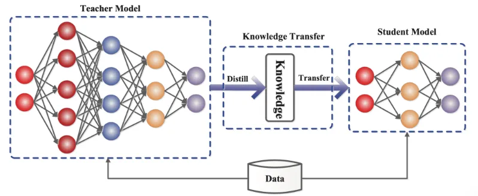

# ChemAP (Chemical structure-based Drug Approval Prediction)

=============

## Aperçu général 

*ChemAP* est un cadre méthodologique conçu pour prédire la probabilité d’approbation d’un médicament à partir de sa structure chimique.  
Il repose sur une architecture enseignant–étudiant, où un modèle enseignant multimodal transmet ses connaissances à deux modèles étudiants basés uniquement sur les représentations chimiques (SMILES et ECFP4).  
Grâce à la distillation des connaissances, ChemAP associe la richesse des représentations multimodales à la simplicité et à la généralisabilité des modèles structuraux.

### Vue d’ensemble du cadre ChemAP 

<!------>

<!-- ### Architecture du modèle

 -->

## Installation et configuration
-------------

### Clonage du dépôt  

Tout d’abord, clonez le dépôt et accedez au répertoire du projet.

    git clone https://github.com/Saadem/ChemAP.git
    cd ChemAP

### Prérequis  

L’entraînement et l’évaluation de ChemAP ont été testés avec les versions suivantes :  

  
  
  
  
  
  
<!---
--->

## Arborescence et description des repertoires et fichiers
L’arborescence ci-dessous présente la structure générale du projet **ChemAP**, incluant les principaux répertoires et scripts :

ChemAP/
│-- dataset/                                # Jeux de données bruts et prétraités
│-- img/                                    # Images et schémas du cadre ChemAP
│-- model/                                  # Modèles entraînés (Teacher, Student, ChemBERT)
│-- src/                                    # Modules Python (prétraitement, modèles, fonctions de perte, etc.)
│   │-- Dataprocessing.py
│   │-- loss_function.py
│   │-- models.py
│   │-- utils.py
│-- ChemAP.py                                # Script principal d’orchestration
│-- data_preprocessing.py                    # Prétraitement des données
│-- FP_predictor_train.py                    # Entraînement du prédicteur ECFP4
│-- SMILES_predictor_train.py                # Entraînement du prédicteur SMILES
│-- Teacher_train.py                         # Entraînement du modèle enseignant multimodal
│-- logreg_l1.py                             # Régression logistique pénalisée
│-- clean_log.py                             # Nettoyage des fichiers logs
└-- README.md                                # Documentation du projet

## Exemples d’utilisation  
-------------

### Préparation des jeux de données  

#### Jeu de référence 

    python data_preprocessing.py --data_path ./dataset --save_path ./dataset/processed_data --split Drug

#### Jeu de données externe  

    python data_preprocessing.py --data_path ./dataset --save_path ./dataset/processed_data --split Drug --dataset External

## Entraînement du cadre ChemAP  

*ChemAP* comprend un modèle enseignant multimodal et deux prédicteurs étudiants fondés sur la structure chimique (SMILES et ECFP4).  
Chaque prédicteur est entraîné séparément, puis la prédiction finale combine leurs probabilités d’approbation par moyenne arithmétique.

### 1. Entraînement du modèle enseignant  

    python Teacher_train.py

### 2. Entraînement du prédicteur basé sur SMILES  

Ce modèle nécessite le *modèle ChemBERT pré-entraîné*, disponible ici :  
[→ Télécharger le modèle ChemBERT](https://drive.google.com/file/d/1-8oAIwKowGy89w-ZjvCGSc1jsCWNS1Fw/view?usp=sharing)

Enregistrez le fichier téléchargé dans le répertoire suivant : `./model/ChemBERT/`

(Optionnel) 
Des versions pré-entraînées des prédicteurs peuvent également être téléchargées ici :  
[→ Modèles pré-entraînés ChemAP](https://drive.google.com/drive/folders/1hiHYnaUobdM8LiWDqrW4P0wMPDuK3hUh?usp=sharing)

- **Modèle ECFP4 :** placer dans `./model/ChemAP/ECFP_predictor/`  
- **Modèle SMILES :** placer dans `./model/ChemAP/SMILES_predictor/`  

Lancer ensuite l’entraînement :  

    python SMILES_predictor_train.py

### 3. Entraînement du prédicteur basé sur fragments 2D (ECFP4)  

    python FP_predictor_train.py

### 4. Prédiction de l’approbation avec ChemAP  

Avant cette étape, les deux prédicteurs étudiants doivent avoir été entraînés.  

    python ChemAP.py --data_type DrugApp

## Inférence  

### Jeu de données externe 

Avant l’inférence, le jeu de données externe doit être prétraité :  

    python ChemAP.py --data_type External

### Liste de médicaments utilisateur  
Pour prédire l’approbation d’une liste personnalisée de molécules :  

    python ChemAP.py --data_type custom --input_file example.csv --output example

## Référence  

Les codes et scripts présentés dans ce dépôt ont été inspirés et partiellement adaptés du travail original de Zhang, Y., Wang, Z., Liu, X., Wu, Q. et Chen, L. (2024), dont les sources sont disponibles [içi](https://github.com/ChangyunCho/ChemAP)    
